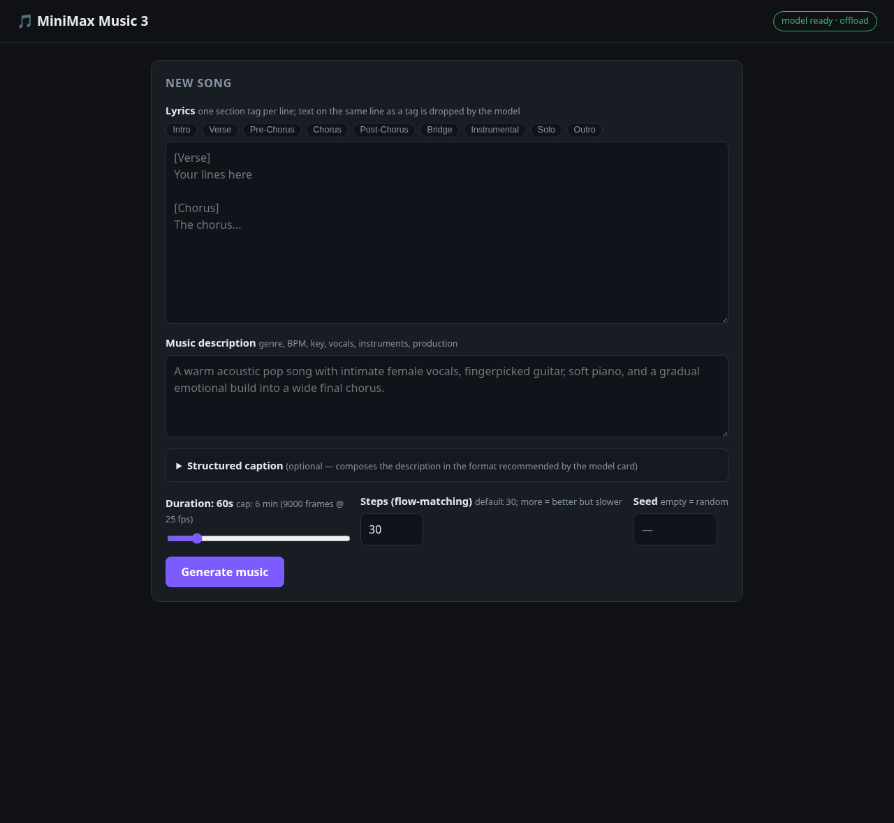

# MiniMax Music3 — Mini Server

Local mini server (FastAPI + plain HTML/JS/CSS) to generate music with
[MiniMax-Music3](https://huggingface.co/MiniMaxAI/MiniMax-Music3) running
in-process via **diffusers** (bf16, ~24GB VRAM — targeting an RTX 3090).



## How it works

- On startup, the server loads the pipeline in a background thread (takes
  **minutes**; the UI shows a "loading model…" badge).
- Generations go through a **FIFO queue** with 1 worker — one at a time on the GPU.
- The final WAV is saved to `output/{job_id}.wav` and served when done
  (no streaming).
- Jobs live in memory only (no persistent history).

## Setup

```bash
python -m venv .venv && source .venv/bin/activate

# PyTorch (adjust the CUDA index to your driver; tested with cu130 + RTX 3090)
pip install torch --index-url https://download.pytorch.org/whl/cu130

# Dependencies (includes the diffusers commit with the Music3 pipeline)
pip install -r requirements.txt

# Run (localhost:8000)
python server.py
```

> On the first run the model (~tens of GB) is downloaded from Hugging Face.
> Tip: download it beforehand with `hf download MiniMaxAI/MiniMax-Music3 --local-dir ./model`
> and run with `MUSIC_MODEL_ID=./model python server.py` (skips the download at startup).
>
> Other env vars: `MUSIC_PORT` (default 8000) and `MUSIC_HOST` (default 127.0.0.1).

## VRAM usage (`MUSIC_OFFLOAD`)

"Low VRAM" recommendations from the model card, selectable via env var:

| Value | What it does | VRAM | Speed |
|---|---|---|---|
| `auto` **(default)** | auto CPU offload | ~22GB | medium |
| `low` | auto CPU offload + LLM group offloading (stream, leaf-level) | **~8GB** | slower |
| `none` | everything on GPU in bf16 | ~24GB | fastest |

```bash
python server.py                        # auto — default (~22GB)
MUSIC_OFFLOAD=low python server.py    # 8GB, slower
MUSIC_OFFLOAD=none python server.py   # full RTX 3090, fastest
```

## API

| Method | Route | Description |
|---|---|---|
| `GET` | `/api/status` | Model status (`loading\|ready\|error`), offload mode, queue length, running? |
| `POST` | `/api/generate` | Create job → `{ "job_id": "..." }` |
| `GET` | `/api/jobs/{id}` | Job status: `queued\|running\|done\|error`, queue position, `audio_url` |
| `GET` | `/api/audio/{id}.wav` | The generated WAV (32 kHz, stereo, 16-bit) |

`POST /api/generate` body:

```json
{
  "instructions": "Genre: acoustic pop. BPM: 96. Key: C major. Warm and intimate...",
  "lyrics": "[Verse]\nYour lyrics here\n[Chorus]\nThe chorus here",
  "duration": 60,
  "num_inference_steps": 30,
  "seed": 7
}
```

- `instructions` (required): music description — genre, BPM, key, vocals, arrangement.
  For fine-grained control, use a *Structured Caption* (Global Metadata, Vocal
  Details, Arrangement); the UI has an optional builder that composes this text.
- `lyrics` (optional): lyrics with section tags (`[Intro] [Verse] [Chorus] ...`),
  each tag on its own line.
- `duration`: target seconds (5–360; model cap: 9000 frames @ 25 fps = 6 min).
  The LM may stop earlier (end-of-audio token).
- `num_inference_steps`: flow-matching steps per window (1–100, default 30;
  more = higher quality but slower).
- `seed`: omit for random (the seed actually used is returned in the job response).

> These are **all** the inputs the pipeline accepts; the remaining sampling
> parameters (LM CFG, top-k) are internal constants of the checkpoint.

curl example:

```bash
JOB=$(curl -s http://127.0.0.1:8000/api/generate \
  -H 'Content-Type: application/json' \
  -d '{"instructions":"A warm acoustic pop song, intimate female vocals, fingerpicked guitar.","lyrics":"[Verse]\nMorning light\n[Chorus]\nBreathe softly","duration":30}' \
  | python -c 'import json,sys; print(json.load(sys.stdin)["job_id"])')

curl -s http://127.0.0.1:8000/api/jobs/$JOB   # poll until status=done
curl -o song.wav http://127.0.0.1:8000/api/audio/$JOB.wav
```

## MCP

`mcp_server.py` exposes the server as **MCP tools** (stdio transport) for
Claude Desktop, Cursor and other MCP clients. It is a thin client over the
HTTP API above — `server.py` must be running.

| Tool | Description |
|---|---|
| `get_status` | Model status (`loading\|ready\|error`), offload mode, queue length, running? |
| `generate_music` | Enqueue a job → returns `job_id` (does **not** wait) |
| `get_job` | Poll a job: status, queue position, `audio_url` when done |

Since generation takes minutes, tools follow the job pattern:
`generate_music` → `job_id` → poll `get_job` until `done`, then use the
absolute `audio_url`.

Install (already in `requirements.txt`):

```bash
pip install fastmcp httpx
```

Client config (Claude Desktop `claude_desktop_config.json`, Cursor
`.cursor/mcp.json`, ...):

```json
{
  "mcpServers": {
    "minimax-music": {
      "command": "/absolute/path/to/minimax-music-ui/.venv/bin/python",
      "args": ["/absolute/path/to/minimax-music-ui/mcp_server.py"],
      "env": { "MUSIC_HOST": "127.0.0.1", "MUSIC_PORT": "8000" }
    }
  }
}
```

> Env vars: `MUSIC_HOST`/`MUSIC_PORT` must match the running `server.py`;
> `MUSIC_BASE_URL` overrides the full URL if needed.

## Structure

```
server.py        # FastAPI: static files + job API + queue worker
mcp_server.py    # optional MCP server (stdio) for the API
static/          # index.html, app.js, style.css
output/          # generated WAVs
requirements.txt
```
